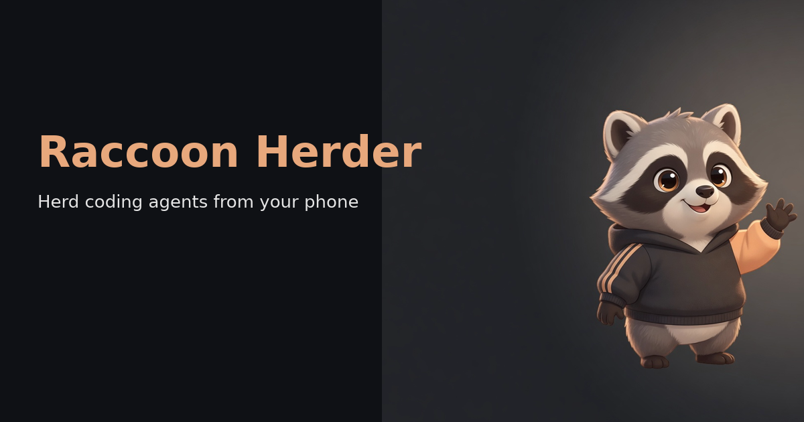

# Raccoon Herder

<p align="center">
  
</p>

Self-hosted **chat control plane** for coding agents — not a terminal in a browser.

**Do not edit these files by hand.** Source markdown is `site/` in the private
[raccoon-herder](https://github.com/shikkie/raccoon-herder) app repo. Rebuild
and publish from there:

```bash
scripts/build-pages.sh
scripts/push-docs.sh
```

`index.html` is the marketing landing page. The operator book starts at
`guide.html`. Open Graph / Twitter cards use `images/og-share.png` (1200×630).
Crawlers need this repo (or GitHub Pages) to be public for unfurls to work.
GitHub Pages is **not** enabled yet; when it is, use `main` / **root**.
